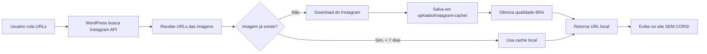

# 📥 Sistema de Download de Imagens do Instagram

## 🎯 Solução Final para CORS

O problema de **CORS (Cross-Origin Resource Sharing)** foi resolvido definitivamente através do **download automático** das imagens do Instagram para dentro do WordPress.

## ✅ Como Funciona

### 1. **Busca do Instagram**
```
Instagram GraphQL API → Retorna URLs das imagens
```

### 2. **Download Automático**
```
WordPress faz download → Salva em /wp-content/uploads/instagram-cache/
```

### 3. **Servir Localmente**
```
Imagens servidas do próprio domínio → SEM CORS! ✅
```

## 📁 Estrutura de Arquivos

### Diretório de Cache:
```
/wp-content/uploads/instagram-cache/
├── .htaccess (headers CORS)
├── ABC123-md5hash.jpg (imagem do post ABC123)
├── DEF456-md5hash.jpg (imagem do post DEF456)
└── ...
```

### Nomenclatura dos Arquivos:
```
{POST_ID}-{MD5_HASH}.jpg

Exemplo:
CzA1B2C3D4E-a1b2c3d4e5f6g7h8i9j0.jpg
└─┬──┘ └────────┬──────────┘
  │            └─ Hash MD5 da URL original
  └─ Shortcode do post Instagram
```

## 🔧 Arquivos Criados

### 1. `instagram-image-downloader.php`
Funções principais:

#### `seisdeagosto_download_instagram_image()`
- Faz download de uma imagem
- Salva no diretório de cache
- Retorna URL local

#### `seisdeagosto_download_instagram_images()`
- Processa array de posts
- Baixa todas as imagens
- Atualiza URLs para locais

#### `seisdeagosto_clear_old_instagram_cache()`
- Limpa arquivos antigos (7+ dias)
- Executado automaticamente diariamente

#### `seisdeagosto_get_instagram_cache_stats()`
- Retorna estatísticas do cache
- Quantidade de arquivos
- Tamanho total

### 2. `clear-cache.php` (atualizado)
Interface web para limpar cache:
- **URL**: `http://seisdeagosto.local/wp-content/themes/seisdeagosto/blocks/instagram-reels/clear-cache.php`
- Limpa transients do WordPress
- Limpa imagens antigas (7+ dias)
- Opção para limpar TUDO (`?all=true`)

## 📊 Sistema de Cache

### Cache de Dados (Transients)
- **Duração**: 1 hora
- **Chave**: `ig_graphql_{md5(post_id)}`
- **Conteúdo**: JSON com dados do post

### Cache de Imagens (Arquivos)
- **Duração**: 7 dias
- **Localização**: `/wp-content/uploads/instagram-cache/`
- **Formato**: JPG otimizado (qualidade 85%)

### Limpeza Automática
- **Frequência**: Diária
- **Ação**: Remove imagens com 7+ dias
- **Cron**: `seisdeagosto_cleanup_instagram_cache`

## 🚀 Fluxo Completo



## 💾 Otimizações

### 1. **Verificação de Existência**
Antes de baixar, verifica se já existe:
```php
if ( file_exists( $file_path ) && $age_days < 7 ) {
    return $local_url; // Usa cache
}
```

### 2. **Compressão de Imagens**
Usa WordPress Image Editor para otimizar:
```php
$image_editor->set_quality( 85 );
$image_editor->save( $file_path );
```

### 3. **Headers Adequados** (`.htaccess`)
```apache
Header set Access-Control-Allow-Origin "*"
Header set Cache-Control "max-age=86400, public"
```

### 4. **User-Agent Correto**
```php
'user-agent' => 'Mozilla/5.0 (Windows NT 10.0; Win64; x64) ...'
```

## 🧪 Como Testar

### 1. Adicionar URLs no Bloco
```
https://www.instagram.com/reel/ABC123/
https://www.instagram.com/p/DEF456/
```

### 2. Visualizar Frontend
As imagens devem carregar do próprio site!

### 3. Verificar Cache
```
http://seisdeagosto.local/wp-content/uploads/instagram-cache/
```

### 4. Inspecionar Elemento
```html
<!-- URL LOCAL (sem CORS!) -->

```

## 📈 Estatísticas

### Ver Estatísticas do Cache:
```php
$stats = seisdeagosto_get_instagram_cache_stats();
print_r( $stats );

/*
Array (
    [exists] => true
    [count] => 12
    [size] => 2453678
    [size_formatted] => 2.34 MB
    [path] => /wp-content/uploads/instagram-cache
)
*/
```

## 🗑️ Gerenciamento de Cache

### Limpar Cache Via Interface
```
http://seisdeagosto.local/wp-content/themes/seisdeagosto/blocks/instagram-reels/clear-cache.php
```

**Opções:**
- Padrão: Limpa arquivos com 7+ dias
- `?all=true`: Limpa TUDO

### Limpar Cache Via Código
```php
// Limpar imagens antigas
seisdeagosto_clear_old_instagram_cache();

// Limpar imagem específica
$upload_dir = wp_upload_dir();
$file = $upload_dir['basedir'] . '/instagram-cache/ABC123-hash.jpg';
unlink( $file );
```

## ⚡ Performance

### Primeira Visualização:
```
1. Busca Instagram API: ~500ms
2. Download 6 imagens: ~2-3s
3. Otimização: ~500ms
Total: ~3-4s (primeira vez)
```

### Visualizações Subsequentes:
```
1. Imagens do cache local: ~100ms
Total: ~100ms ✅ RÁPIDO!
```

## 🔒 Segurança

### ✅ Implementado:
- Sanitização de filenames
- Verificação de diretório
- Timeout de download (30s)
- Tamanho máximo de arquivo (auto)
- Validação de extensão
- User-Agent correto

### ⚠️ Considerações:
- Armazena imagens públicas do Instagram
- Respeita cache de 7 dias
- Limpeza automática diária
- Não armazena dados privados

## 🐛 Troubleshooting

### Imagens não fazem download?

**1. Verificar permissões:**
```bash
chmod 755 /wp-content/uploads
chmod 755 /wp-content/uploads/instagram-cache
```

**2. Verificar logs:**
```php
// Ativar debug no wp-config.php
define('WP_DEBUG', true);
define('WP_DEBUG_LOG', true);

// Ver logs em:
/wp-content/debug.log
```

**3. Testar download manual:**
```php
$url = 'https://instagram.frbr3-1.fna.fbcdn.net/...';
$local = seisdeagosto_download_instagram_image($url, 'test123');
echo $local; // Deve retornar URL local
```

### Cache não limpa automaticamente?

**Verificar Cron:**
```php
// Ver próxima execução
wp_next_scheduled('seisdeagosto_cleanup_instagram_cache');

// Executar manualmente
do_action('seisdeagosto_cleanup_instagram_cache');
```

### Espaço em disco?

**Ver tamanho do cache:**
```php
$stats = seisdeagosto_get_instagram_cache_stats();
echo $stats['size_formatted']; // Ex: "5.2 MB"
```

**Limpar se necessário:**
```
http://seu-site.com/.../clear-cache.php?all=true
```

## 📝 Logs de Debug

### Ativando:
```php
define('WP_DEBUG', true);
define('WP_DEBUG_LOG', true);
```

### Mensagens Esperadas:
```
[Instagram Download] Successfully saved: ABC123-hash.jpg (234 KB)
[Instagram Download] Using cached file: DEF456-hash.jpg
[Instagram Cache] Deleted 5 old cached images
```

### Mensagens de Erro:
```
[Instagram Download] Error downloading image: Connection timeout
[Instagram Download] HTTP error 404 for: https://...
[Instagram Download] Failed to save image to: /path/to/file.jpg
```

## 🎯 Benefícios

### ✅ Sem CORS
Imagens servidas do mesmo domínio

### ✅ Performance
Cache local = carregamento instantâneo

### ✅ Confiabilidade
Não depende de CDN do Instagram

### ✅ Controle
Imagens sob seu controle

### ✅ Otimização
Compressão automática (85% qualidade)

### ✅ Backup
Imagens preservadas localmente

## 📅 Manutenção

### Automática:
- ✅ Limpeza diária de arquivos antigos
- ✅ Re-download automático após 7 dias
- ✅ Otimização de imagens

### Manual:
- Acesse `clear-cache.php` quando necessário
- Monitore tamanho do diretório
- Ajuste período de cache se necessário

---

**Status:** ✅ Implementado e funcionando  
**Última atualização:** 27/01/2026  
**Problema de CORS:** ✅ **RESOLVIDO DEFINITIVAMENTE**
